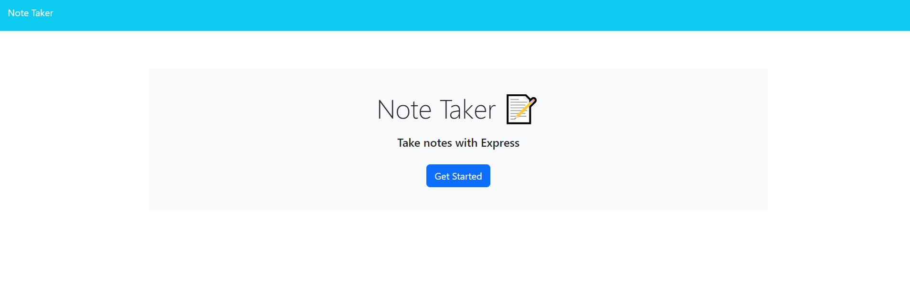
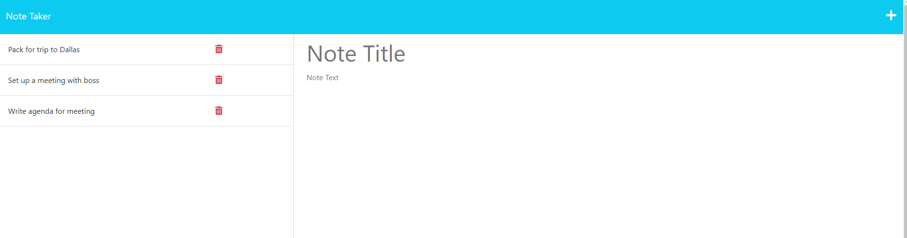
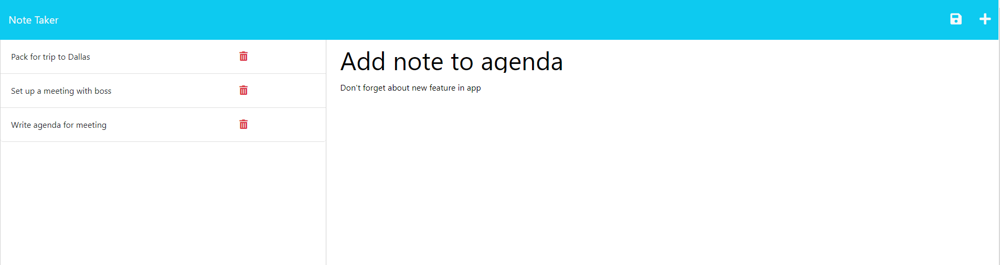
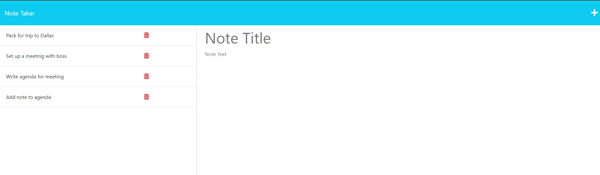
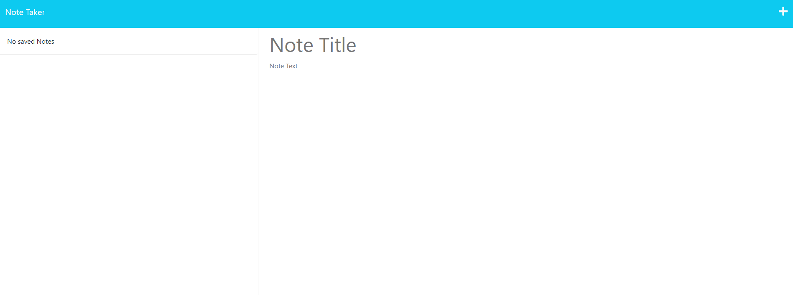

# Note Taker

## Description

This is a note taking application using Express. This app takes user input and stores it in a database. The database is shown in the left column of the page. You can also delete notes out of the database.

This app is easy way to jot down quick notes and save them. It takes the saved notes and display it to see what notes have been taken. Once the user is done with it, they can simply delete it.

One of the challenges I faced is trying to debugging why new notes were not saving. Once I understood I needed to read, parse and write to the data, the app was working properly.

Here's the link to the app: https://nameless-cliffs-84541-4130007a5820.herokuapp.com/

## Table of Contents

- [Installation](#installation)
- [Usage](#usage)
- [Credits](#credits)
- [License](#license)

## Installation

N/A

## Usage

Once you start the app, you will see the landing page with a "Get Started" button. It should look like this:

Clicking on the "Get Started" button will take you to the notes page. It should look similar to this:

The user should be able to go through the notes saved and add notes through the add icon. Here's what it should look like when you input notes:

Notice that save icon appears right next to the add icon once you filled out the title and text of the note you want to add. 

Click on the save icon and it should save it. The note will be stored on the left column. It should look like this:

Users can delete notes from the database through the trash icon. This is what the app looks like when you delete all the notes:

## Credits

Boot Camp Tutor, Alexis Gonzalez

[Procademy's Youtube](https://www.youtube.com/watch?v=00NNuZHF56A&ab_channel=procademy)

## License

MIT License

Copyright (c) 2023 Catherine Nguyen

Permission is hereby granted, free of charge, to any person obtaining a copy
of this software and associated documentation files (the "Software"), to deal
in the Software without restriction, including without limitation the rights
to use, copy, modify, merge, publish, distribute, sublicense, and/or sell
copies of the Software, and to permit persons to whom the Software is
furnished to do so, subject to the following conditions:

The above copyright notice and this permission notice shall be included in all
copies or substantial portions of the Software.

THE SOFTWARE IS PROVIDED "AS IS", WITHOUT WARRANTY OF ANY KIND, EXPRESS OR
IMPLIED, INCLUDING BUT NOT LIMITED TO THE WARRANTIES OF MERCHANTABILITY,
FITNESS FOR A PARTICULAR PURPOSE AND NONINFRINGEMENT. IN NO EVENT SHALL THE
AUTHORS OR COPYRIGHT HOLDERS BE LIABLE FOR ANY CLAIM, DAMAGES OR OTHER
LIABILITY, WHETHER IN AN ACTION OF CONTRACT, TORT OR OTHERWISE, ARISING FROM,
OUT OF OR IN CONNECTION WITH THE SOFTWARE OR THE USE OR OTHER DEALINGS IN THE
SOFTWARE.
